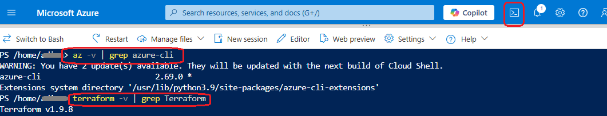
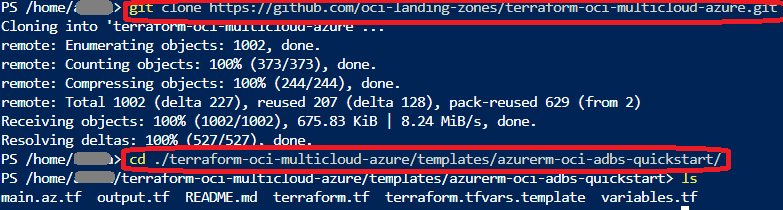
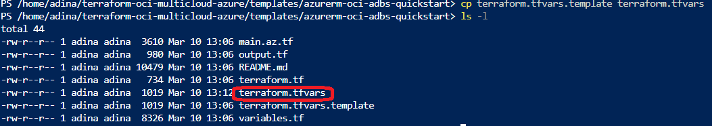
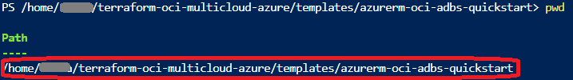
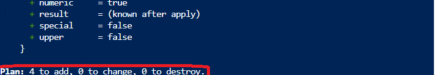

# Oracle Database@Azure

## Provision Autonomous Database with Terraform
<walkthrough-tutorial-duration duration="30"></walkthrough-tutorial-duration>

[](https://github.com/oci-landing-zones/terraform-oci-multicloud-azure/blob/main/images/architecture.png?raw=true)

In this tutorial, you will 

1. Setup your Terraform environment for this tutorial
2. Provision an Oracle Autonomous Database@Azure in a new Azure Virtual Network (VNet)
3. Provision a client VM in a new client subnet
4. Perform a sample query from client VM
5. Cleanup the environment

**Let's get started!**

<walkthrough-footnote>[OCI Multicloud Landing Zone for Azure](https://github.com/oci-landing-zones/terraform-oci-multicloud-azure)</walkthrough-footnote>

## Prerequisites
This tutorial has the following prerequisites:
- **[Oracle Database@Azure subscription](https://www.oracle.com/cloud/azure/oracle-database-at-azure/)**
- **[Azure Subscription](https://learn.microsoft.com/en-us/azure/cost-management-billing/manage/create-subscription)**
- **[Azure CLI](https://learn.microsoft.com/en-us/cli/azure/install-azure-cli)** 
- **[Terraform 1.5+](https://learn.microsoft.com/en-us/azure/developer/terraform/install-configure)** 

<walkthrough-footnote></walkthrough-footnote>


### Using Azure Cloud Shell (recommended) <walkthrough-cloud-shell-icon	></walkthrough-cloud-shell-icon>
- Run Azure Cloud Shell in either PowerShell or bash mode. You can optionally mount a storage account to persist files between sessions. If persistent storage is enabled, files and configurations (including Terraform state) will be retained across sessions. Otherwise, the session runs in temporary mode, and files will be lost when it ends.

- If you don’t enable storage, the session runs in [**temporary mode**](https://learn.microsoft.com/en-us/azure/cloud-shell/persisting-files), and **all files will be lost when the session ends**, including Terraform state and configurations. 

<walkthrough-footnote>[OCI Multicloud Landing Zone for Azure](https://github.com/oci-landing-zones/terraform-oci-multicloud-azure)</walkthrough-footnote>


### Verify software installation
- **Azure Cloud Shell** comes with already [pre-installed tools](https://learn.microsoft.com/en-us/azure/cloud-shell/features#tools) e.g. Terraform and Azure CLI. 

  

- **Azure CLI** 
  ``` sh
  az -v | grep azure-cli
  OR in PowerShell
  az version | ConvertFrom-Json | Select-Object @{Name="azure-cli"; Expression={$_.'azure-cli'}} | ConvertTo-Json -Compress
  ```
  You should get among other information "azure-cli": "X.X.X"

- **Terraform**: 
  ``` sh
  terraform -v | grep Terraform
  OR in PowerShell
  (terraform -v | Select-String -Pattern "Terraform v\d+\.\d+\.\d+").Matches.Value
  ```
  You should get `Terraform vX.X.X`
<walkthrough-footnote></walkthrough-footnote>


## Authentication in Azure CLI & Terraform
Azure Cloud Shell supports integrated authentication, while a local shell requires explicit authentication setup.

### Azure Cloud Shell <walkthrough-cloud-shell-icon	></walkthrough-cloud-shell-icon>
- Azure Cloud Shell automatically authenticates with your Azure account.
- **If you're using Cloud Shell, you can proceed to next step and skip the below 'Local Shell' section.** 

<walkthrough-footnote></walkthrough-footnote>

### Local Shell 
- If you are using Local Shell you need to sign in manually:
  ```sh
  az login
  ```
- This opens a browser for authentication. 
- If using a service principal, authenticate with:
  ```sh
  az login --service-principal -u APP_ID -p CLIENT_SECRET --tenant TENANT_ID
  ```
For Terraform, configure authentication by setting up the Azure Provider:
- [**Authenticate Terraform with Azure**](https://learn.microsoft.com/en-us/azure/developer/terraform/authenticate-to-azure?tabs=bash)

<walkthrough-footnote>[OCI Multicloud Landing Zone for Azure](https://github.com/oci-landing-zones/terraform-oci-multicloud-azure)</walkthrough-footnote>


## Azure Subscription
- You need an Azure Subscription to provision resources for this tutorial. Follow this [guide](https://learn.microsoft.com/en-us/azure/cost-management-billing/manage/create-subscription) to create a subscription if you don’t have one.
- You can find your current subscription ID in the [Azure Portal](https://portal.azure.com/)
- Check if your subscription is active and accessible using the following command (replace SUBSCRIPTION_ID with your actual ID): 
  ``` sh
  az account show --subscription SUBSCRIPTION_ID
  ``` 
<walkthrough-footnote>[OCI Multicloud Landing Zone for Azure](https://github.com/oci-landing-zones/terraform-oci-multicloud-azure)</walkthrough-footnote>

## Running the Terraform code - Provision an Autonomous Database + VNet + Resource Group
### 1. Template [azurerm-oci-adbs-quickstart](https://github.com/oci-landing-zones/terraform-oci-multicloud-azure/tree/main/templates/azurerm-oci-adbs-quickstart) will be used. 

- Please clone it to your Cloud Shell or local shell.
  ```
  git clone https://github.com/oci-landing-zones/terraform-oci-multicloud-azure.git
  ```

- Then cd to the *terraform-oci-multicloud-azure/templates
/azurerm-oci-adbs-quickstart* directory

  

<walkthrough-footnote></walkthrough-footnote>

### 2. Customize the sample configuration
- Create a file *terraform.tfvars* by copying the *terraform.tfvars.template* existing file into the same directory *azurerm-oci-adbs-quickstart*.

  

- Open *terraform.tfvars* to update `az_region`, `name` and `admin_password` to start with. The `admin_password` password must be between 12 and 30 characters long, and must contain at least 1 uppercase, 1 lowercase, and 1 numeric character. It cannot contain the double quote symbol or the username 'admin', regardless of casing.
- Review the other commented variables from the file. They come with default values (defined in *variables.tf*), but you can customize those by uncommenting them and giving them the values as needed.
- Save the file when you're done.

<walkthrough-footnote></walkthrough-footnote>
### 3. Initialize Terraform 
- In your shell, make sure you are in the directory where the terraform configuration is located.

  

- Initialize Terraform with the following command. 
  ``` bash
  terraform init
  ``` 
  You should get `Terraform has been successfully initialized!`. 

  
  
  This prepares the working directory, including accessing state, downloading provider plugins, and fetching modules.

<walkthrough-footnote></walkthrough-footnote>
### 3. Validate configuration
- Validate the TF configuration with the following command, which will generate an execution plan for review.
  ``` bash
  terraform plan
  ``` 
- You should get the following with this template.
  `Plan: 4 to add, 0 to change, 0 to destroy.`

  

<walkthrough-footnote></walkthrough-footnote>
### 4. Provision resources 
- Run the following command to proceed when the execution plan is good to go. 
  ``` bash
  terraform apply
  ``` 
- Review and confirm the plan by typing `yes` to proceed.
- It's a good time for a coffee break when you see
  `azurerm_oracle_database_autonomous_database.this: Still creating... [10s elapsed]` 
  <walkthrough-tutorial-duration duration="20"></walkthrough-tutorial-duration>

<walkthrough-footnote></walkthrough-footnote>
### 5. Provision complete!
- When you're back, you should get something like this: 

  `Apply complete! Resources: 4 added, 0 changed, 0 destroyed.`

- Once the infrastructure is provisioned, Terraform will also display something like:
  ```
  Outputs:

  adb_id = "ocid1.autonomousdatabase.oc1..aaaaaaa..."
  adb_private_endpoint = "adb-private.subnet.vcn.oci.oraclecloud.com"
  adb_service_console_url = "https://adb.region.oraclecloud.com/console"
  adb_wallet_zip_file = "/path/to/wallet.zip"
  adw_connection_strings = {
    "low"    = "adb.region.oraclecloud.com:1521/your_db_low"
    "medium" = "adb.region.oraclecloud.com:1521/your_db_medium"
    "high"   = "adb.region.oraclecloud.com:1521/your_db_high"
  }
  az_resource_group_name = "my-azure-resource-group"
  az_subnet_id = "/subscriptions/<sub_id>/resourceGroups/<rg>/providers/Microsoft.Network/virtualNetworks/<vnet>/subnets/<subnet>"
  oci_tgw_id = "ocid1.transitgateway.oc1..xxxx"
  workload_subnet_id = "ocid1.subnet.oc1..yyyy"
  ```
  
<walkthrough-footnote>[OCI Multicloud Landing Zone for Azure](https://github.com/oci-landing-zones/terraform-oci-multicloud-azure)</walkthrough-footnote>

## Provision a client VM in a new client subnet

### Congratulations
You've successfully provision an Autonomous Database of *Oracle Database@Azure with Terraform (modules)*. 
<walkthrough-conclusion-trophy></walkthrough-conclusion-trophy>

<walkthrough-footnote></walkthrough-footnote>
### Let's make some changes
- Now you can expand the architecture by adding a client subnet and VM with SQLPlus pre-installed using the `oradb-client` template. 
- Append the below configuration to the <walkthrough-editor-open-file filePath="cloudshell_open/terraform-oci-multicloud-gcp/examples/adbs-minimal/main.tf" startLine="19" endLine="20">main.tf</walkthrough-editor-open-file>. Save when you're done.
  ```tf
  module "oradb-client" {
    # source = "github.com/oracle-quickstart/terraform-oci-multicloud-gcp//templates/oradb-client"
    source = "../../templates/oradb-client"
    project = local.project
    location = local.location
    network_name = module.azure-oci-adbs-quickstart.network_name
    cidr = "10.2.0.0/24"
  }

  output "client_vm" {
    value = module.oradb-client.client_vm
  }
  ```
- Use the following command to install the newly added module
  ```sh
  terraform init -upgrade
  ```
  You should see something like `Upgrading modules...`
- Now you can review and apply the changes
  ```sh
  terraform apply
  ```
  You should see `Plan: 6 to add, 0 to change, 0 to destroy.`, confirm proceed with `yes`.
- You get a new output `client_vm` when the apply complete.

<walkthrough-footnote></walkthrough-footnote>

### Check Terraform Idempotency
- You can check the terraform idempotency by re-running `terraform apply`
  ```sh
  terraform apply
  ```
- As no change is expected, you should get 
  `No changes. Your infrastructure matches the configuration.`
  
<walkthrough-footnote>[OCI Multicloud Landing Zone for Azure](https://github.com/oracle-quickstart/terraform-oci-multicloud-azure)</walkthrough-footnote>

## Perform a sample query from client VM

### Make use of the Terraform output
- You can export the Terraform outputs as environment variables by using `terraform output` and `jq`.
- Run the following commands in Cloud Shell
  ```sh
  export VM_SUBSCRIPTION=$(terraform output -json client_vm | jq -r '.project')
  export VM_REGION=$(terraform output -json client_vm | jq -r '.zone')
  export VM_NAME=$(terraform output -json client_vm | jq -r '.name')
  export CONNSTR=$(terraform output -raw connstr)
  echo VM_SUBSCRIPTION = $VM_PROJECT
  echo VM_REGION = $VM_ZONE
  echo VM_NAME = $VM_NAME
  echo CONNSTR = $CONNSTR
  ```
<walkthrough-footnote></walkthrough-footnote>

### Query the Autonomous Database from the client VM
- Use azcopy or scp to copy the sample SQL file to the client VM: 
  ```sh
  scp -o StrictHostKeyChecking=no cloud_identity.sql azureuser@$VM_NAME:~/  
  ```
    - If using Azure Bastion, use az network bastion ssh.
- You can query the Autonomous Database from the client VM using SSH and SQLPlus:
  ```sh
  ssh azureuser@$VM_NAME "sqlplus admin/$TF_VAR_admin_password@'$CONNSTR' @cloud_identity.sql" 
  ```
  - If you receive `SQLPlus not avaialble` error, retry after a little while. The SQLPlus installation may still be in progress.
  - You can use the following command to verify the sqlplus installation.
    ```sh
    ssh azureuser@$VM_NAME "sqlplus -v"
    ```
<walkthrough-footnote></walkthrough-footnote>

### Connect SQLPlus at the client VM
- Alternatively, connect to SQLPlus directly on the client VM for any other queries:
  ```bash
  ssh azureuser@$VM_NAME "sqlplus admin/$TF_VAR_admin_password@'$CONNSTR'"
  ```
<walkthrough-footnote>[OCI Multicloud Landing Zone for Azure](https://github.com/oracle-quickstart/terraform-oci-multicloud-azure)</walkthrough-footnote>

## Congratulations
You've successfully complete the tutorial by querying the Autonomous Database from the client VM with SQLPlus.
<walkthrough-conclusion-trophy></walkthrough-conclusion-trophy>

### What's next:
- **Continue with [RAG Chatbot engine](https://github.com/oci-landing-zones/terraform-oci-multicloud-azure/blob/main/docs/tutorials/adbs-rag-chatbot/README_RAG.md)**: Use the Autonomous Database you've just provisioned as vector database for building a RAG Chatbot engine.
- **Don't forget to clean up**: Run the following command to cleanup the environment when you're done with all the related tutorials.
    ```bash
    terraform destroy
    ```
- **Explore more**: See the [OCI Multicloud Landing Zone for Azure](https://github.com/oci-landing-zones/terraform-oci-multicloud-azure) for more Terraform modules, templates, examples, and tutorials for Oracle Database @ Azure.

<walkthrough-footnote>[OCI Multicloud Landing Zone for Azure](https://github.com/oci-landing-zones/terraform-oci-multicloud-azure)</walkthrough-footnote>

<walkthrough-footnote></walkthrough-footnote>
